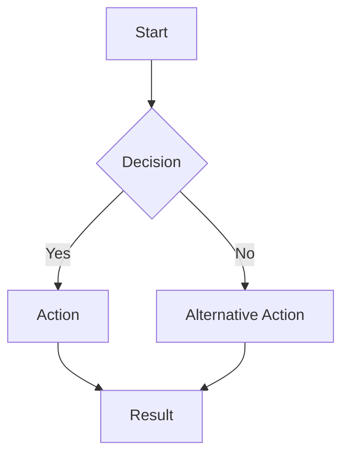

# Mermaid Sketcher

A modern, interactive web application for creating beautiful diagrams using Mermaid syntax with AI-powered assistance. Built with React, TypeScript, and Tailwind CSS.

## 🌟 Features

- **Live Mermaid Editor**: Write Mermaid syntax and see your diagrams render in real-time
- **AI-Powered Diagram Generation**: Describe your diagram in natural language and let AI generate the Mermaid code for you
- **Dark/Light Theme Support**: Toggle between themes for comfortable viewing
- **Export Functionality**: Save your diagrams as SVG files
- **Responsive Design**: Works seamlessly on desktop and mobile devices
- **Split-Pane Interface**: Edit code on one side, preview on the other

## 🚀 Tech Stack

- **Frontend Framework**: React 18 with TypeScript
- **Build Tool**: Vite
- **UI Components**: shadcn/ui with Radix UI primitives
- **Styling**: Tailwind CSS with custom glass-morphism effects
- **Diagram Rendering**: Mermaid.js
- **State Management**: React hooks with TanStack Query
- **Routing**: React Router DOM
- **Form Handling**: React Hook Form with Zod validation
- **Icons**: Lucide React
- **File Export**: File-saver.js

## 📦 Installation

### Prerequisites

- Node.js (v18 or higher)
- npm, yarn, or bun

### Setup

1. **Clone the repository**
   ```bash
   git clone <YOUR_GIT_URL>
   cd mermaid-sketcher
   ```

2. **Install dependencies**
   ```bash
   npm install
   # or
   yarn install
   # or
   bun install
   ```

3. **Start the development server**
   ```bash
   npm run dev
   # or
   yarn dev
   # or
   bun dev
   ```

4. **Open your browser**
   Navigate to `http://localhost:5173` (or the port shown in your terminal)

## 🛠️ Available Scripts

- `npm run dev` - Start development server with hot reload
- `npm run build` - Build for production
- `npm run build:dev` - Build for development mode
- `npm run preview` - Preview production build locally
- `npm run lint` - Run ESLint

## 🎯 Usage

### Creating Diagrams

1. **Manual Editing**: Write Mermaid syntax directly in the editor
2. **AI Generation**: Use the AI prompt to describe your diagram in natural language
3. **Export**: Save your diagrams as SVG files using the export button

### Supported Diagram Types

- Flowcharts
- Sequence diagrams
- Class diagrams
- State diagrams
- Entity Relationship diagrams
- User journey diagrams
- Gantt charts
- Pie charts
- And more!

### Example Mermaid Syntax



## 🎨 Features in Detail

### Editor
- Syntax highlighting for Mermaid code
- Auto-save functionality
- Real-time validation
- Customizable font size

### AI Assistant
- Natural language to Mermaid conversion
- Context-aware suggestions
- Multiple diagram type support

### Preview
- Live rendering of Mermaid diagrams
- Theme-aware display
- Zoom and pan capabilities
- High-quality SVG export

## 🔧 Configuration

### Environment Variables

The app supports the following environment variables:

- `VITE_API_KEY` - OpenAI API key for AI features (optional)

### Customization

- **Themes**: Modify `tailwind.config.ts` to customize colors and themes
- **Components**: All UI components are located in `src/components/`
- **Pages**: Main application pages are in `src/pages/`

## 🚀 Deployment

### Vercel (Recommended)

1. Connect your repository to Vercel
2. Vercel will automatically detect the framework and build settings
3. Deploy with one click

### Netlify

1. Build the project: `npm run build`
2. Upload the `dist` folder to Netlify
3. Configure build settings if needed

### Docker

```dockerfile
FROM node:18-alpine
WORKDIR /app
COPY package*.json ./
RUN npm ci --only=production
COPY . .
RUN npm run build
EXPOSE 5173
CMD ["npm", "run", "preview"]
```

## 🤝 Contributing

1. Fork the repository
2. Create a feature branch: `git checkout -b feature/amazing-feature`
3. Commit your changes: `git commit -m 'Add amazing feature'`
4. Push to the branch: `git push origin feature/amazing-feature`
5. Open a Pull Request

## 📄 License

This project is licensed under the MIT License - see the LICENSE file for details.

## 🙏 Acknowledgments

- [Mermaid.js](https://mermaid.js.org/) for powerful diagram generation
- [shadcn/ui](https://ui.shadcn.com/) for beautiful UI components
- [Tailwind CSS](https://tailwindcss.com/) for utility-first styling
- [Vite](https://vitejs.dev/) for fast development experience

## 📞 Support

If you encounter any issues or have questions:

1. Check the [Issues](../../issues) page
2. Create a new issue with detailed information
3. Join our community discussions

---

